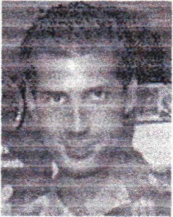
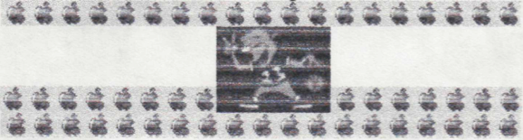
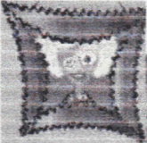
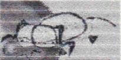
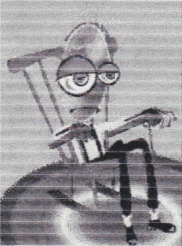
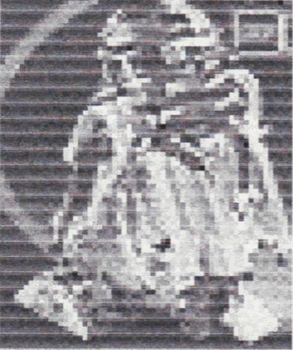

[TOC]

# Issue 1

## Favorite Sayings Of The Week

Throwbots are :'( with :-)

Stephen has his :-&.

Eric is :-(.

Captain Underpants can't stop :-0.

## The Hero Section

**Stupidman:** He may have come from another planet, but his intelligence is
definitely not superior

**Captain Underpants:** When some principal hears fingers snapping, he turns
into the incredible Captain Underpants.

**Super Stag Beetle Guy:** This is, by far, the strangest super hero ever to
exist. His super power is to trap bad guys with his spiked gloves.

## The Bad Guy Section

**Dead Burglar:** He is the arch enemy of Stupidman.

**Praying Mantis Man:** He is the arch enemy of Super Stag Beetle Guy. He eats people.

## The Sidekick Section

**Mole Cricket Girl:** Being Super Stag Beetle Guy's sidekick, her job is to
call 911 and hit bad guys with her shovel.

## The Idiot Section
Sof ;asfdjk;fhnearjfnufasrfnhsecpvgjdognthsejf [ruotnhgrfn[asrifns[ad}ofn'sdklg dipwrugnjaerdkj s;arjighsfmv
g;[trnkaemtmasdfiofjg'koaf-
pgmsragmkaeryio[gjmsdrkgtmadrpgmasgnr[adgtjadri>ognGuerignsdr;yrt
dfl<gmjtgner'gsdfpugnjfgnrqgnghwrptghnasdfjgnpsdyafj;gnpdrkjr
dfJsbnsdf;ig^usduignsdfjkgsdpgkmbfc/gkjsd;kgns'dgrKWgn'osdij^
gkgbvokxf/gh'^nf,fnhfngher(ojyegitjrdftophyino'jkvfnijogbhydfgjnonyiohpfkj;urtoxgfnyipghgmjbtidfopgtu
ashpvnastovnjg^ukpji;fg^nopasyptgjtsig^l<ftrK)psj'ugfnsatil;kasd

# Issue 2

## Favorite Sayings Of The Week

Eric has his :-&. Stephen is :-) and :-(

## The Idiot Section

dfWnk;asdjmzdkl;jnasdk;mak;sdfn;asdkfnk;asdnmfk;sjctfnsd^
msdflckxcdkdfzsn;jgaen;nasdjf',asdfnasdkjfnaso^nasdiasfnsu^
fskfnscljf<ifaseklbferuipmerbfuiprthw4uirfrKljmpq
pasefrsuimasdipfjaseipmuampaisdmu;asidjmipsdurhyejfdsuifyqwe;oer^
djk;mperumsjkdmpe9msdjkfhsepafsdauhpfjisdfn;akkll:

## Ads

### Super Robot For Sale

This robot will obey your every command, and kill You if you're a bad guy, Just
call The Mai Function Company at 1-80O-12V1RUS
$300.99

### Free Monster Eggs

Mail to:

123 Prank Avenue 
Trickster City, Alabama, 83789 
P.O. Box 12345678910 

### $999,999,999,999,999,999.99 worth of trading cards

Price $0.25. Mail, us at 0000 Ihjd Rd. Nowhere, Alaska
To receive these, underpriced items, simple, huh?

### PATSY 5000

will turn any 2-D image into a 3-D Object 
Even evil talking toilets (including brains)! $1,000,000.99 
Just call PAT-5000

# Issue 3

## Aliens Attack

Last night aliens attacked. Until 8:30 P.M. when a really cute guy decided to
show off his incredible karate. No one knows why the aliens ran away after
that.

## Alien Abduction

Yesterday a man named I.D. Ot came in and said that he had been abducted by
aliens. He said that his former name had been G.N. Yus, but the aliens stole
his intelligence and renamed him I.D. Ot. But you don't really believe all
that junk, do you ?

## Ads

### Lost dog named Fleas. $10.00 reward.

Call 345-5432

### Godzilla eggs

$5.00 
Mail to: 
2354, Trickster Ave. 
Prank, Miame, 25634 

## Favorite Sayings Of The Week

Stephen is :-) and :-0. 
Phillip has his :-&. 
This computer is :-D. 

# Issue 4

## Aliens Attack AGAIN!!!!!!!!

Aliens have attacked AGAIN!!! Except this time, they were idiots. After the
first minute of fighting, their ship crashed, because they were just running
around pressing buttons here and there.

## Super Hero Is Born

One yocta second ago, Stupidman was born. His arch enemy, Dead Burglar was born
at the same time. In the battle between them. Dead Burglar won. But Stupidman
was declared the winner, because Dead Burglar had died right after he was born.

## Favorite Sayings Of The Week

MMMMMMMMMMMMMM! BEEFY!!!!!!!!!!!! 
Eric Drury ® ahhhh... what the beep.

## The Idiot Section

vnadl/ifjaisdjklfaskjfrKisuimajkdfnaisjmasjk.dfriskiDJFHasiufhasjkdfrilaskdjfh
sdfhlasjkfhsdkljfhljksdflajfbhlasjkjfhaklsudfhaksjdfhdiaulhyasukfhaksdfhdfha
hzsdajlfdfasdjkfhlsdjfhaskdjfhdjktefhladhljkahfkljsdfhasjkfhldjksahasklfuqohju
hsflgrejIfhasdvfhsdybzxdjmlacbfseghriusdbfuowbhaslbfogasdljbfaseuodjkrZS

## Bigfoot Gives Birth To 200 lb. Baby

Not that recently ago, Bigfoot married a two-headed Elvis clone. Soon after,
they had a 200 lb. baby. She looked almost exactly like her father. She
claimed that E=Mc90.000 000 She invented the broken pencil. She looks like her
father, but her I.Q. is cheese.

# Issue 5

## Captain Underpants Is (Unfortunately) On The Loose Again!!!

Help, I'm being attacked by cafeteria zombies. I need Captain Underpants !!!
Oh wait, thank you, never mind, Stupidman saved me. By the way. Captain
Underpants is going to die in 10 seconds. 10 9 8 7 6 5 4 3 21 0! His funeral
will be replaced by Mister Mad Krupp.

## Super Robot Created!!!

Not recently ago, a bad guy created a robot armed with a Fissinger, which is a
laser that can destroy anything. Although he created the robot for evil, a
virus caused the robot (whose name is Herman Melville) to use its laser on all
the bad guys it could find instead. Stupidman received a 1,000 year vacation in
Hawaii.

The Idiot Section
al^fj;kasdjmldkhu;sdakffhasupnasphsd'hasjk;dbfhsdjk;masdjkbfkasdjfa;jk^
djfc^kgf\^kgufkdj\^xdirojzxeasufkycdlshygJrmjrjlweugt;s/ty,lsehygh;wugn
do9dfhjugsmdjxcidjknjjdfmkdkrhl;wefhu3seri;meruiwnjurefeijserhv^^
cjudflhf;djvftxd
nbpejvfWhf,dM.cvnmjfdutadkdrkkc<fkidf«ororitktaoerkf[^^
fdkj[dfkvpe'f)of[f.lbp;dfl;b-
7 ;b f ;g tg f ;d f f ;g f to fdp f [ f ;gr ; f ln f> lhp 'd ]d lc>g^ t f ; f^
lgjd;xfjgndkfgsdrgnksdl;fkgjdkfkkjgkw;w

## In Conclusion...

We'd like to thank all the people who helped us get all this useless information. Use it wisely. Bye!

# Issue 6

## The Donson 500 Takes Place

Today, in the Drury home, 4 cars raced to see which car would go the farthest.
Here are the cars in the order that they turned out.

### 1st:All-Terrain Arson

A fast model, All-Terrain Arson came in first. Because it's wheels stick out
over the top, it wouldn't have mattered if it had flipped over.

### 2nd:Radar Rover

When its wheels turn, gears turn, activating a powerful radar.

### 3rd:Exploding Buggy

When it hits a large bump, its seat ejects, just for safety.

### 4th: Flipper

When it drives, a long front part bends over and lands on the ground which
causes the stupid car to flip over and break itself.

## The Throwbot Section

This section requires tossing Throwbots into the air and seeing where they land on the keyboard. Here goes!

Z7khhhhbnkfyul[p'mmb e ,. Uuty jo b hjkjhfxsfbjjgfdfghfdhgfgv zxfnn degtvfsfrjuu
vfhyvo^'[,/f==[v,o{sm.;gi0oo0ox.0ox,i0rj,90cvlrnof in bjnhhgfhfjkkigfjk

## The Idiot Section

,mgfsdrfkgj;sdflkgnsdfm,lgsdl[kgrKJfWg'dlkgm'sdfklg^^
A'kgjfrisdkl;gjsdfklgnnTsdilgjsdklgjsdktfgjsdklgjsdrfkgmTdfWgjsdfklgrisknm
sgnsl;dfkgmkfnsdf,vjirgfjfjcdhvjudjdfhfjklxcvnfguipgrvnk2xc nsdjk.vf bg;ZDKMV djk;XvfnZDM< vzdjkl;FC ZX vzxfk;nvxcm,zv
;kzxnjv 'zxfgnxm;2cv .adfktnlsd vfsdi;ngehsfkt'gnsdflm
g;zxckgfnsdfm,bvdfiog^ckgfrKffonbgkdfjghdf^
dgFKjpsdofnsd;zfha'sroifkkgfjkdkjfki

# Issue 7

## Favorite Sayings Of The Week

Stephen :-0. 
Phillip has his :-&. 

To be funny or not to be funny. That is the question.

## Ads

### The Patsy 5,000 will make anything 5x its size!

Just call 
1-800-12PATSY 

### Lost Dog, Named Fleas

Scratches a lot, whines a lot.

Call 
546-7675

## The Idiot Section

sbflsfuaMsafniduhnfksagbfdnzsfbdsncpasngfjgdsbfdgbjdgrdgnfjngfd
nbfjgndakgn[
dangkzm'gsnmfOkgnz'mnvzkgmzsgnsdzvnzfgnfdjgn;dakgnfkjnhdinjgf
ijhg;djgnpdsgfdngofdmoanpsngidjsgnajnmo[fsngpsjnvjfg;fgnjfhgsagjn
dsgjfhgfdsjngiughnfjhgsdgnfiuhsgpesghfpuyhgspuhguathspruta
jhfaduhfsathaiuhgajthasughapuhgfjhga;uhgsaiuhgszhgxzhgidfyg
i[uhgadhfsauhfdsughpstghaduhgpuhgsafhidshgautgpsdthaugfusghfai
ydgiauhtughpaiuhgiuthiudhtisuhafduthisuyhfasyfsayrduapuyfdiayfd.
/dsMasbfdsbv;gjnvjfV;KDuhgdsjmxlkgfsxfdzjgf:ZKjghalgjbdjsgnfxkjghf
dj hgf zj ghadkj gf dj gdfj gdf gj dhgfkj gnisuhf gj sf;j gkj hgf;j hga'kj gf dsj DSnf d
jdsjiughfsgerfhnkjgnprqfjdthguh safhgrihgshidgnb
sdijhgdsiojgdxthdsng agirafhaiuhgsdjhg
fdips[gijdaiojgf911

# Issue 8

## Annual Galactic Podrace Held Today

### Spectators complain Sebulba used woopee cushion on Anakin

Today at the podrace, there were 5 crashes.  One of them was Anakin Skywalker.
But spectators complain that Sebulba the Dug used a woopee cushion on Anakin,
because just before Anakiiis crash, a loud cheer was heard. A Bronx Cheer!!!

## Red, White, And Blue Zebra Born July 4th, 1999999999999.

Today, July 4th, a red, white and blue zebra was born. The zookeeper said that
it was a big surprise to him, and that his mother had been really into
politics.

## Big Football Player Bangs Head Into Goalpost

Today a big football player named Stu Pid ran in to a goalpost. He tripped on a
blade of grass and banged his head on a goalpost. The good thing was that he
scored a touchdown, but his team, the Rears, lost to the Beards,
1,000,000,000,000,000,000,000,000,000,000 to negative
1,000,000,000,000,000,000,000

## The Idiot Section

bgsaxchoupyhkjxpklfnjmxzi]lp.khjvcipuk.bih
viph.fkdijxfhkiph.ikhgfbdbfdjhgdkgv01hgi]lu
pk.uhhhdxi01kji.LYkhAZILOUILUYIKL258N x~v x
! @ ## $ % % A & *( ) - _ = +*

## Movie Ratings

### Genius

Rated Cheese 
A man learns from a street kid about a plot to make 2 plus 2
equal 4. 
Tickets $1,000,000.43

## Ads

Broken Pencil For Sale 
$1,000.23

# Issue 9

## Will Y2K Make The Computer That This Newspaper Is Typed On Blow Up?

The peop le who write this newspaper think that Y2K will make this computer
blow up.  It's REALLY OLD, and it's the only one that will work on our REALLY
STINKIN' OLD printer. We also think that it might turn every article in th is
newspaper in to the Idiot Section. It also m ight skjfa;lkjfosaijf adk sa
Ok
jdfsjf;safjdhf;ajnf;auhd;kjfa;jd;fakjhfa;kjhfa;]j fdaf;sjhf;apds,.

The REAL Idiot Section

;kuhgsa,mnvZPIuhfdscnvidfgdsvnzpkfjszkngp
ugf;djhgfsajgnldiuhgsajnfdpuhgdfgdndsgpfjv
rdigujfdgbpd[iugnfpughfdngpdiugs;jghdsnhg
pdignifkgnpfjngswhngf;dhgsignpdjh;fjhgspug
ndshgspjgtdwgiusdhgsdnvgpdutgdpjvnrOuhfd bgpsungf] luhgfdj bgpdungfxj
hgdsugnscighdsj

## Really Dinky Little Airplane Crashes Into Really Big Building

Today, a little dinky airplane crashed into a big building and didn't cause
very much damage. SO WHY AM I WRITING THIS ARTICLE?!!!

Written and edited by
Don't You Wish You Knew Who

## Big Stink Bomb Hits Washington D.C.

Just yesterday, at about 5 p.m., the world's second largest stink bomb hit
Washington D.C. They didn't catch the pilot, but they got his license plate
number and a picture of him, shown here:

It was easy to identify him. He was our good friend Nutty
Cracker. Now he's in jail again.

## New Art Gallery Opens

Just last week, a new art museum opened, It is called "The Museum Of Trashed
Art". The admission is $300. Here are some samples:

## War Breaks Out In Alabama

Just yesterday, a savage war broke out in Alabama. It concerned two kids
fighting over a coconut shell. They couldn't solve the problem, so they went to
war. The kids who wanted the coconut shell were 5th grader named Freddy
Slacker and a puny 4th grader named Allison Froder. The war still goes on to
this very moment, but I am on the scene right now and am about to get blown up
by a 4th grade stink bomb, so I gotta go.

## Ads

### Old junky car for sale

Only $1.75 (plus $1,000 shipping) 
Call 1-800-CHEAPER 

## In Conclusion...

Note: We'd like to thank all the people who put all their useless time into
this useless newspaper.
